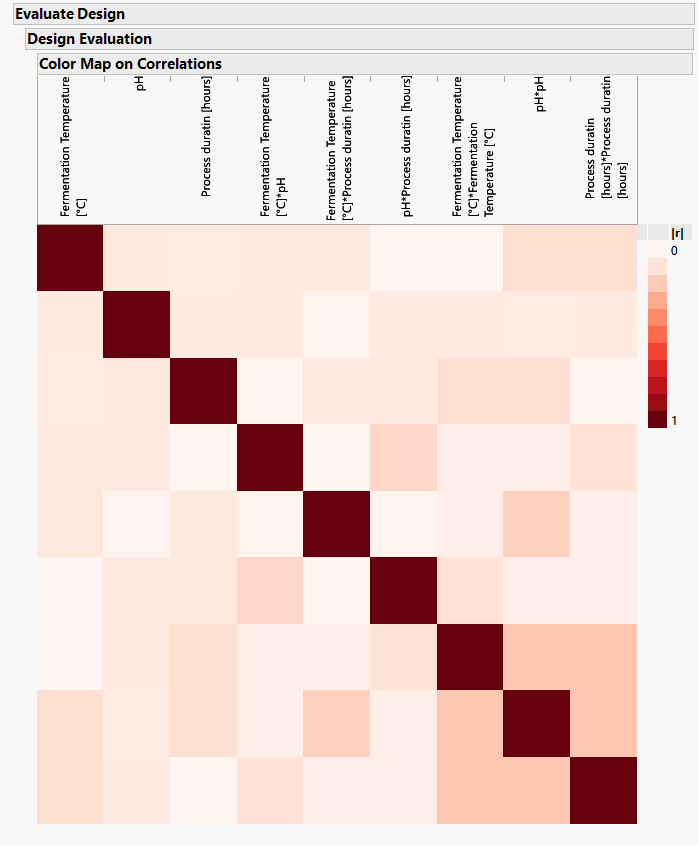
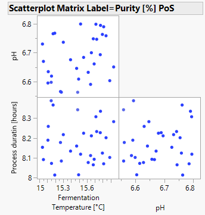
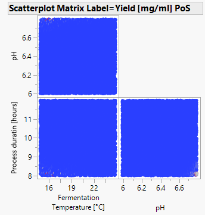
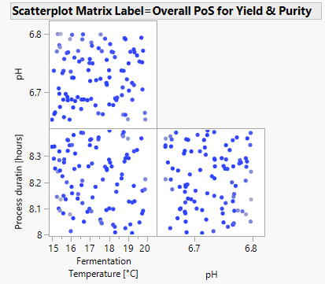

layout: true

background-image: url(gsk.png)
background-position: 100% 0%
background-size: 20%

<!-- <hr style="border:2px solid blue"> -->
---

class: center, middle
```{r xaringan-themer, include=FALSE, warning=FALSE}
# https://pkg.garrickadenbuie.com/xaringanthemer/articles/xaringanthemer.html#themes
library(xaringanthemer)
library(flextable)
library(kableExtra)
library(officer)
library(data.table)
library(tidyverse)
library(kableExtra)
library(rmarkdown)
library(openxlsx)
library(readxl)

std_border = fp_border(color="gray")
std_borderFoot = fp_border(color="black", width = 2)

```

# Case study

---

## Objective

**Optimization** of the fermentation process, to maximize the process yield and the purity of the recombinant
protein ABC.

- Three critical process parameters (CPPs) were selected during the screening phase.

  - Fermentation Temperature, range selected: 15°C – 25°C
  - pH, range selected: 6 – 6.8
  - Process duration, range selected: 8 h – 12 h

- An additional noise factor is included into the Optimization Phase: 

  - Day
  
- CQAs to monitor
  - Purity (%)
  - Yield (mg/ml)
  
---
class: center, middle

## Design evaluation

* .left[Determine the assumed model for the DoE:
  * Continuous: 
      - Fermentation Temperature
      - pH 
      - process duration
  * Blocking: Day
  ]
  
* .left[Diagnostics considered
* Correlations
* Power
* Prediction variance plots
    * HTML report]

---

class: center, middle

```{r workDR, echo=FALSE, warning=FALSE}

myDir = unlist(strsplit(getwd(), '/'))
twd = paste0(myDir[-length(myDir)], collapse = '/')

#  Data
df = read_excel(paste(twd, "/data/Case_study.xlsx", sep=""), sheet = "Sheet1") %>%
  mutate_if(is.character, as.factor)

specificationsPurity = 80
specificationsYield = 7

format_fn = function(x) formatC(x, format = 'f', digits = 2)
abs_fn = function(x) abs(x)


```


```{r correlation_designEvaluation, out.height = "500px", out.width='450px', echo=FALSE, warning=FALSE, message=FALSE}



```

* .left[small off-diagonal correlations 
  - max 0.3 (pH & pH2); $\le 0.2$ for others
      - the lower the better for orthogonality amongst the effects]
    
---
class: center, middle

## Exploratory analysis on the DoE data

* .left[HTML report
  * graphical assessment of CPP-CQA relationship
  * Day-CPP interactions present?
  
  * What to do with runs where issues were reported
      - analyze with & without the problematic runs
      - discuss way forward with scientist
  ]
  
---

class: center, middle

### Purity vs pH

```{r experimentaldataEDAPurity, echo=FALSE, results = 'asis', warning=FALSE, eval = TRUE}

tmp <- data.frame("Purity" = df[['Purity [%]']], "Yield" = df[["Yield [mg/ml]"]],
                  Comment = df[["Comment"]], x = df %>% pull(pH))
  
ggplot(tmp %>% group_by(x) %>% mutate(MeanPurity = mean(Purity)), 
       aes(x= x, y = Purity, col = Comment)) + 
  geom_point(shape = 16, size = 2, stat = "identity") + 
  theme_bw() + labs(y = "Purity [%]", x = 'pH') +
  geom_jitter(width = 0.0001, height = 0) + 
    scale_y_continuous(breaks = c(specificationsPurity, seq(50, 100, 10)), limits = c(50, 100)) +
  geom_hline(yintercept = specificationsPurity, linetype="dashed", col="red") +
  geom_line(aes(x = `x`, y = `MeanPurity`), colour="blue", linetype="solid", linewidth=1) +
  guides(col = guide_legend("Comment"), linetype = guide_legend("specs/mean"))

```

---
class: center, middle

### Yield vs pH

```{r experimentaldataEDAYield, echo=FALSE, results = 'asis', warning=FALSE, eval = TRUE}

ggplot(tmp %>% group_by(x) %>% mutate(MeanYield = mean(Yield)), 
            aes(x= x, y = Yield, col = Comment)) + 
  geom_point(shape = 16, size = 2, stat = "identity") + 
  theme_bw() + labs(y = "Yield [mg/ml]", x = 'pH') +
  geom_jitter(width = 0.0001, height = 0) + 
  geom_hline(yintercept = specificationsYield, lty="dashed", col="red") +
  scale_y_continuous(breaks = c(specificationsYield, seq(4, 12, 2)), limits = c(4, 12)) +
  geom_line(aes(x = `x`, y = `MeanYield`), colour="blue", linetype="solid", linewidth=1) +
  guides(col = guide_legend("Comment"), linetype = guide_legend("specs/mean"))

```

---
class: center, middle

## Model fit on the DoE data

* .left[For each CQA:]

$$\text{y}_{i} = \beta_0 + \beta_{02}\text{Day}_{i2} + \beta_{03}\text{Day}_{i3} + \sum_{j=1}^3 \beta_j\text{x}_{ij} + \sum_{j=1}^3\sum_{\substack{k=1}}^3\beta_{jk}\text{x}_{ij}\text{x}_{ik} + \epsilon_{i}$$

* .left[HTML report
  * with data where issues were reported
  * without data where issues were reported
    - suggestion to analyse excluding those where issues were reported
      - after discussing with the scientist
    ]

---
class: center, middle

### Purity

```{r PurityModelEstimates2, warning=FALSE, echo=FALSE, message=FALSE}

dfAnalysis = df %>% rename("Fermentation" = `Fermentation Temperature [°C]`, "Process" = `Process duratin [hours]`,
                           "Purity" = `Purity [%]`, "Yield" = `Yield [mg/ml]`) %>%
  mutate(Purity = Purity/100)

# data where issues were reported excluded

dfAnalysis3 = dfAnalysis %>% filter(is.na(Comment)) %>%
  mutate(Purity = Purity*100, Fermentation2 = (Fermentation-20.5556)*(Fermentation-20.5556), 
         pH2 = (pH-6.51111)*(pH-6.51111), Process2 = (Process-10)*(Process-10), 
         FermentationpH = (Fermentation-20.5556)*(pH-6.51111), 
         FermentationProcess = (Fermentation-20.5556)* (Process-10), 
         ProcesspH = (Process-10) * (pH-6.51111), # Day1 = ifelse(Day == "Day 1", 1, 0),
         #Day2 = ifelse(Day == "Day 2", 1, 0)
         )

lmPurity2 = lm(Purity ~ Day + Fermentation + pH + Process + Fermentation2 + pH2 + Process2 +
             FermentationpH + FermentationProcess + ProcesspH, data = dfAnalysis3)

lmPurityTable2 = (summary(lmPurity2)$`coefficients`) %>% as.data.frame() %>%
  mutate_if(is.numeric, .funs = format_fn) %>% rownames_to_column() %>%
rename("Term" = 1)


flextable(lmPurityTable2) %>%
  hline(part="body", border = std_border) %>% 
  hline_bottom(part="body", border = std_borderFoot) %>% 
  hline_top(part="body", border = std_borderFoot) %>%  
  merge_h(part = "header") %>%  width(j = c(3), width = c(1.15)) %>% 
  align(align = "center", part = "all") %>% align(align = "left", part = "all", j = 1) %>% 
  fix_border_issues(part = "all") %>% hline_top(part="header", border = std_borderFoot) %>% 
  fontsize(size = 12, part = "all")

```


* .left[Some effects changed significance (with vs without data with issues)]
  
---

class:center, middle

### Yield

```{r YieldModelEstimates2, warning=FALSE, echo=FALSE, message=FALSE}

lmYield2 = lm(Yield ~ Day + Fermentation + pH + Process + Fermentation2 + pH2 + Process2 +
             FermentationpH + FermentationProcess + ProcesspH, data = dfAnalysis3)


lmYieldTable2 = (summary(lmYield2)$`coefficients`) %>% as.data.frame() %>%
  mutate_if(is.numeric, .funs = format_fn) %>% rownames_to_column() %>%
rename("Term" = 1)


flextable(lmYieldTable2) %>%
  hline(part="body", border = std_border) %>% 
  hline_bottom(part="body", border = std_borderFoot) %>% 
  hline_top(part="body", border = std_borderFoot) %>% 
  merge_h(part = "header") %>%  width(j = c(3), width = c(1.15)) %>% 
  align(align = "center", part = "all") %>% align(align = "left", part = "all", j = 1) %>% 
  fix_border_issues(part = "all") %>% hline_top(part="header", border = std_borderFoot) %>% 
  fontsize(size = 12, part = "all")

```


* .left[Some effects changed significance (with vs without data with issues)]

---
class: center, middle

### Could we go further? 

* .left[Bivariate analysis]
* .left[Other distributions(?)

  - Beta: Purity (%)
  - Skew normal: Yield (mg/ml)]

* .left[Bayesian methods?]

---

class: left, middle

## Design space

* Objective

  * Relationship between CPPs and quality (specifications)
  * To guarantee, with a high probability, that the process yield & purity of the recombinant protein ABC will pass the acceptance criteria

* Types

  * Average: takes average estimate of relationship & adds residual error to simulate individual batches
      - JMP, desirability
  * Full uncertainty: Bayesian modelling accounting for uncertainty in the estimation of relationship itself & residual error uncertainty 
      - lower PoS, esp. around the edges 

---
class: center, middle

### Purity $\ge$ 80%  

```{r OOSprobOptimalSettingsPurity, echo=FALSE, warning=FALSE, out.height = "500px", out.width='450px', message=FALSE}



```

---

class: center, middle

### Yield $\ge$ 7mg/ml

```{r OOSprobOptimalSettingsYield, echo=FALSE, warning=FALSE, out.height = "500px", out.width='450px', message=FALSE}



```

---

class: center, middle

### Purity $\ge$ 80% and Yield $\ge$ 7mg/ml 

```{r OOSprobOptimalSettingsPurityYield, echo=FALSE, warning=FALSE, out.height = "500px", out.width='500px', message=FALSE}



```

---

class: center, middle

# Attribute Non-Attendance (ANA) in Discrete Choice Experiments

<!-- --- -->

<!-- class: center, middle -->

<!-- ## Discrete Choice Experiment -->

```{r choiceTable, warning=FALSE, echo=FALSE, message=FALSE}

choiceTable = data.frame(rbind(
c("Delivery time" , 6 , 1), 
c("Delivery price" , 4 , 0),
c("Returns"      , "Free" , "Own cost"),
c("Rating"       , 3    , 1),
c("Discount"     , 0    , 15),
c("Trust label" , "Yes" , "No"),
c("Headquarters" , "Not Belgian" , "Belgian"),
c(" ", " ", " "),
c(" ", " ", " "),
c(" ", " ", " "),
c(rep("Which Webshop would you prefer?", 3)),
c("Webshop A", "Webshop B", "None")
)) %>% rename("Webshop" = `X1`, "A" = `X2`, "B" = `X3`)

# flextable(choiceTable) %>%
#   bold(bold = TRUE, part = "header") %>%
#   hline(part="body", border = std_border) %>% 
#   hline_bottom(part="body", border = std_borderFoot) %>% 
#   hline_top(part="body", border = std_borderFoot) %>% merge_h(part = "header") %>%  
#   merge_h(part = "body") %>% align(align = 'center', i = 7, part = 'body') %>% 
#   width(j = c(1, 2, 3), width = c(1.5, 1.2, 1.2)) %>% 
#   align(align = "center", part = "all") %>% align(align = "left", part = "all", j = 1) %>% 
#   hline(part="body", border = std_borderFoot, i = 7) %>%
#   hline(part="body", border = fp_border(color = "white"), i = c(8:12)) %>%
#   fix_border_issues(part = "all") %>%hline_top(part="header", border = std_borderFoot) %>%
#   fontsize(size = 12, part = "all")

```


---

## Discrete Choice Experiment & ANA

.pull-left[

```{r, warning=FALSE, echo=FALSE, message=FALSE}

flextable(choiceTable) %>%
  bold(bold = TRUE, part = "header") %>%
  hline(part="body", border = std_border) %>% 
  hline_bottom(part="body", border = std_borderFoot) %>% 
  hline_top(part="body", border = std_borderFoot) %>% merge_h(part = "header") %>%  
  merge_h(part = "body") %>% align(align = 'center', i = 7, part = 'body') %>% 
  width(j = c(1, 2, 3), width = c(1.5, 1.2, 1.2)) %>% 
  align(align = "center", part = "all") %>% align(align = "left", part = "all", j = 1) %>% 
  hline(part="body", border = std_borderFoot, i = 7) %>%
  hline(part="body", border = fp_border(color = "white"), i = c(8:12)) %>%
  fix_border_issues(part = "all") %>%hline_top(part="header", border = std_borderFoot) %>%
  fontsize(size = 12, part = "all")

```

]


.pull-right[

* Before: use all attributes

* Now: task simplification
  - Ignoring attributes: ANA
      - screening
  - ANA as a static behavior
  - Yet, which attribute to screen-out may change 
      - newer information
      - change in status
]

---

class: center, middle

```{r choiceLong, echo=FALSE, out.height = "500px", out.width='540px', echo=F}

knitr::include_graphics("Univ_longitudinalchoices.png")

```

---

class: center, middle

## Objective

Model changes in choice-makers' ANA behavior when information is provided 

---
class: center, middle

## Background: state of the art

* .left[Taste preference changes: changes in $\beta$
  * Introduce interaction terms]

* .left[Changes in ANA?

  * Infer ANA using Latent class models
  * Introduce interchanges between ANA states
      - Hidden Markov Model (HMM, order 1)]

---

class: center, middle

## Questionnaire: choice experiment

<center>

```{r choiceQuestionnaire, warning=FALSE, echo=FALSE, message=FALSE, fig.align = 'center'}

p = DiagrammeR::grViz("digraph rmarkdown {
  graph [layout = dot, rankdir = TB]
  
  node [shape = rectangle, fontsize=25, color=black, penwidth=3.5] 
  edge[minlen=2, color=black, penwidth=3.5]
  rec1 [label = '&#92;n   Block-1: \n \n Choice sets 1 to 7   &#92;n ']
  rec2 [label =  '&#92;n   Attribute information on: \n \n Trust label \n Headquarters \n Distance  &#92;n ']
  rec3 [label = '&#92;n   Block-2: \n \n Choice sets 8 to 14   &#92;n ']
  
  # edge definitions with the node IDs

  {rank=same ; rec1 -> rec2 -> rec3};

  }")

p
```

</center>

---

class: center, middle

### Information provided on attributes

```{r attributeInform, echo=FALSE, out.height = "500px", out.width='800px'}

knitr::include_graphics("Attribute_Information.png")

```

---
class: center, middle

## Statistical modelling

### Multinomial logit model with interactions

\begin{aligned}
U_{ms} =  & \underbrace{\beta_0\mbox{OOut}_{ms} + \sum_{j=1}^7\beta_j\mbox{x}_{jms} + \mbox{Info}_s\Big(\sum_{j=6}^7\alpha_j\mbox{x}_{jms}\Big)}_{V_{ms}} + \epsilon_{ms} \\
\\
p_{ms} =  & \frac{e^{V_{ms}}}{\sum_{m\prime = 1}^M e^{V_{m\prime s}}}
\end{aligned}

---

class: left, middle

### Multinomial logit model + interactions + static ANA

* $Z_{ij}$ & $K_{ij}$ equal 1 if person $i$ attended to attribute $j$, 0 ow

\begin{aligned}
V_{ms}|\boldsymbol{z}_{i}, \boldsymbol{k}_{i} = & \\
&\beta_0\mbox{OOut}_{ms} + \sum_{j=1}^5\beta_j\mbox{z}_{ij}\mbox{x}_{jms} + \sum_{j=6}^7\beta_j\mbox{k}_{ij}\mbox{x}_{jms} + \mbox{Info}_s\Big(\sum_{j=6}^7\alpha_j\mbox{k}_{ij}\mbox{x}_{jms}\Big) \\
 \\
p(\boldsymbol{z}_{i}, \boldsymbol{k}_{i}|\boldsymbol{\theta}) = & \prod_{j=1}^5 \theta_j^{z_{ij}}(1-\theta_j)^{1-z_{ij}}\prod_{j=6}^7 \theta_j^{k_{ij}}(1-\theta_j)^{1-k_{ij}} \\
 \\
p_{i} = & \sum_{z_i, k_i}p(\boldsymbol{z}_{i}, \boldsymbol{k}_{i}|\boldsymbol{\theta}) \prod_s\prod_m (p_{ms}| \boldsymbol{z}_{i}, \boldsymbol{k}_{i})^{y_{ims}} 
\end{aligned}

---
class: left, middle

### MNL + changing ANA where Info was given

* HMM has 2 sets of ANA probabilities: initial and transition
* Index $b$ added to $K_{ij}$ with $b = 1 (b = 2)$ for pre (post) -information

\begin{aligned}
p(\boldsymbol{z}_i, \boldsymbol{k}_{i1}|\boldsymbol{\theta}) = \prod_{j=1}^5 \theta_j^{z_{ij}}(1-\theta_j)^{1-z_{ij}}\prod_{j=6}^7 \theta_j^{k_{ij1}}(1-\theta_j)^{1-k_{ij1}} \\
p(\boldsymbol{k}_{i2}|\boldsymbol{k}_{i1}, \boldsymbol{\delta}) =  \prod_{j=6}^7\Big(\delta_{j|1}^{k_{ij2}} (1-\delta_{j|1})^{1-k_{ij2}}\Big)^{k_{ij1}}  \Big(\delta_{j|0}^{k_{ij2}} (1-\delta_{j|0})^{1-k_{ij2}}\Big)^{1-k_{ij1}}  &\\
\\
p_i =  \sum_{z_i, k_{i1}}\sum_{k_{i2}}p(\boldsymbol{z}_i, \boldsymbol{k}_{i1}|\boldsymbol{\theta})p(\boldsymbol{k}_{i2}|\boldsymbol{k}_{i1}, \boldsymbol{\delta})\prod_m\prod_s\prod_b(p_{ms}| \boldsymbol{z}_{i}, \boldsymbol{k}_{ib})^{y_{ims}} &
\end{aligned}

---

class: left, middle

## Results

### Model comparison (N = 203)

```{r modelComparisonResults, warning=FALSE, echo=FALSE, message=FALSE}

ModelTable = data.frame(rbind(
c("MNL + interactions" , 12 , -2311, 4647, 4687), 
c("MNL + interactions + static ANA" , 20 , -2115, 4271, 4337),
c("MNL + changing ANA"      , 23 , -2095, 4236, 4312)
)) %>% rename("Model" = `X1`, "Par" = `X2`, "LL" = `X3`, "AIC" = `X4`, "BIC" = `X5`)

flextable(ModelTable) %>%
  bold(bold = TRUE, part = "header") %>%
  hline(part="body", border = std_border) %>% 
  hline_bottom(part="body", border = std_borderFoot) %>% 
  hline_top(part="body", border = std_borderFoot) %>% merge_h(part = "header") %>%  
  width(j = c(1), width = c(2.75)) %>% 
  align(align = "center", part = "all") %>% align(align = "left", part = "all", j = 1) %>% 
  fix_border_issues(part = "all") %>%hline_top(part="header", border = std_borderFoot) %>%
  fontsize(size = 12, part = "all")

```


### Attention to attributes where info was provided

* Higher attention post-information vs pre-information

  - attention post-information given no attention pre-info was significant
  - attention post-information given attention pre-info was certain

---
class: center, middle

## Conclusions

* .left[Modeling impact of information through ANA changes may be more informative than through introducing interaction terms]

* .left[Attribute information significantly increases their attention probability]

---
class: center, middle

# References

* .left[Maaya, L., Meulders, M., and Vandebroek, M. (2020).
Online consumers' attribute non-attendance behavior: Effects of information provision. _International Journal of Electronic Commerce, 24(3):338{365._]

* .left[Maaya, L., Meulders, M., Vandebroek, M. (2021). Joint analysis of preferences and drop out data in discrete choice. _Journal of Choice Modelling, 41, Art.No. ARTN 100308_]